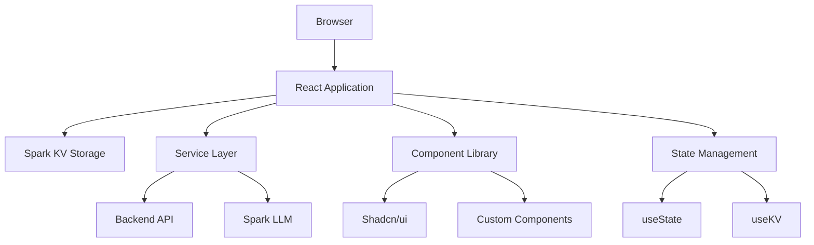
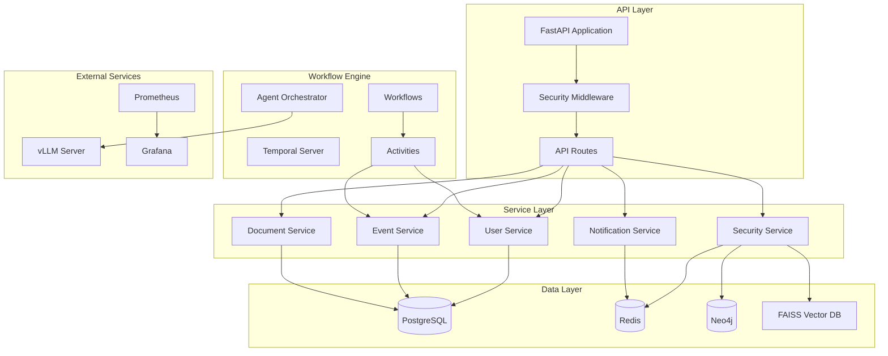
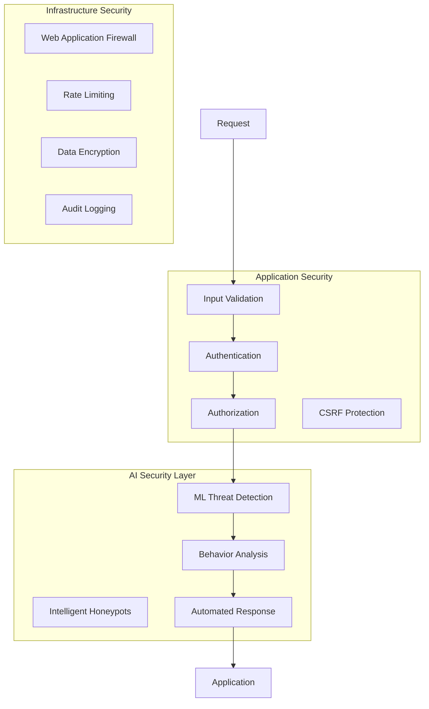
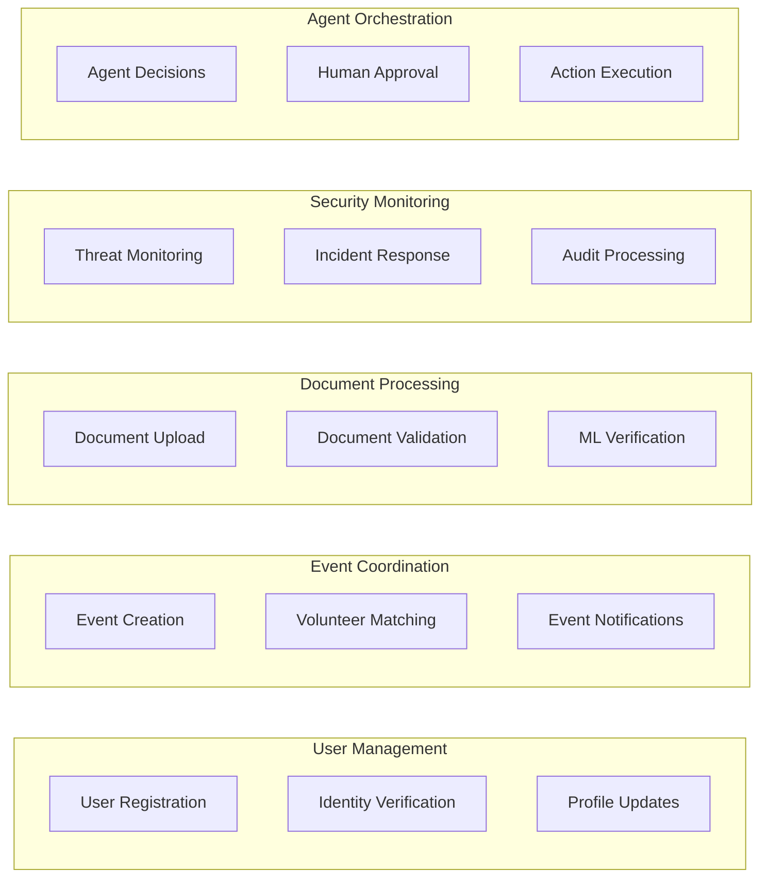
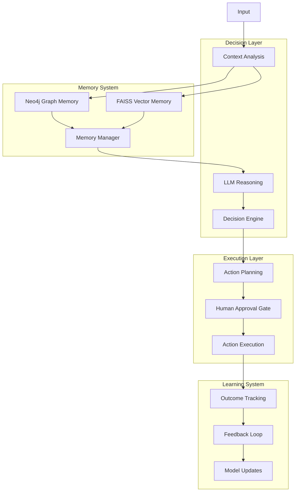
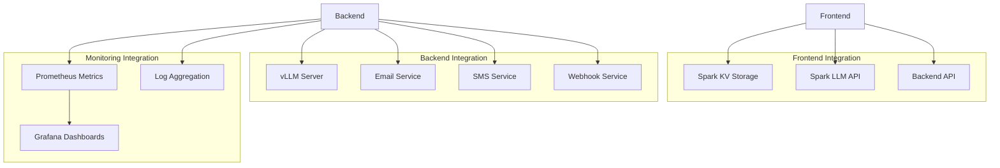
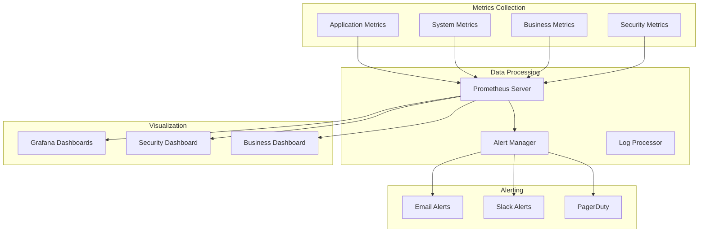

# System Architecture Documentation

## Overview

Voluntier is a comprehensive, autonomous agent-driven platform that integrates community members, organizations, and local businesses into a cohesive network. The system employs a modern, distributed architecture with enterprise-grade security, real-time capabilities, and AI-powered automation.

## Architecture Principles

### Design Philosophy
1. **Autonomous-First**: AI agents handle routine operations with human oversight for critical decisions
2. **Security by Design**: Enterprise-grade security integrated from the ground up
3. **Scalability**: Microservices architecture designed for horizontal scaling
4. **Reliability**: Temporal workflows ensure fault-tolerant operations
5. **Accessibility**: WCAG 2.1 AA compliance across all interfaces
6. **Performance**: Sub-second response times for all user-facing operations

### Key Architectural Decisions
- **Monorepo Structure**: Frontend and backend in single repository for development efficiency
- **Event-Driven Architecture**: Asynchronous processing for scalability and resilience
- **Hybrid Deployment**: Spark-compatible frontend with production-ready backend
- **Multi-Database Strategy**: Different databases optimized for specific use cases
- **Container-First**: Docker containerization for consistent deployment

## System Components

### Frontend Architecture



#### Technology Stack
- **Framework**: React 18 with TypeScript
- **Styling**: Tailwind CSS with custom design system
- **Components**: Shadcn/ui component library
- **State**: GitHub Spark KV for persistence, React state for UI
- **Build**: Vite with modern ES modules
- **Testing**: Jest with React Testing Library

#### Component Architecture
```
src/
├── components/
│   ├── ui/           # Base shadcn/ui components
│   ├── signup/       # Registration workflows
│   ├── profiles/     # User profile management
│   ├── onboarding/   # Guided setup processes
│   ├── upload/       # Document handling
│   └── verification/ # Identity verification
├── services/         # Business logic layer
├── types/           # TypeScript definitions
├── hooks/           # Custom React hooks
└── lib/             # Utility functions
```

### Backend Architecture



#### Technology Stack
- **API Framework**: FastAPI with Python 3.12+
- **Workflow Engine**: Temporal for reliable task execution
- **Databases**: PostgreSQL, Redis, Neo4j
- **AI/ML**: vLLM for autonomous decision-making
- **Monitoring**: Prometheus + Grafana
- **Containerization**: Docker Compose

## Data Architecture

### Database Strategy

#### PostgreSQL (Primary Database)
```sql
-- Core user and business data
Users, UserProfiles, Organizations, Businesses
Events, EventRegistrations, VolunteerHours
Documents, VerificationRecords
SecurityEvents, AuditLogs
```

**Features:**
- ACID transactions for critical business data
- Full-text search capabilities
- JSON columns for flexible schema
- Row-level security for multi-tenancy

#### Redis (Caching & Sessions)
```
-- Session management
user_sessions:{user_id} -> session_data
auth_tokens:{token_hash} -> user_id

-- Rate limiting
rate_limit:{ip}:{endpoint} -> request_count
security_blocks:{ip} -> block_info

-- Real-time data
active_users -> set of user_ids
notification_queue:{user_id} -> list of notifications
```

**Features:**
- Sub-millisecond data access
- Pub/Sub for real-time notifications
- Lua scripting for atomic operations
- Clustering for high availability

#### Neo4j (Relationship Graph)
```cypher
// Community relationship modeling
(User)-[:VOLUNTEERS_FOR]->(Organization)
(User)-[:ATTENDS]->(Event)
(User)-[:REFERENCES]->(User)
(Organization)-[:HOSTS]->(Event)
(Organization)-[:PARTNERS_WITH]->(Business)
```

**Features:**
- Complex relationship queries
- Graph algorithms for community analysis
- Real-time graph traversal
- Pattern matching for fraud detection

#### FAISS (Vector Search)
```python
# Semantic similarity for matching
volunteer_embeddings = faiss.IndexFlatIP(768)
event_embeddings = faiss.IndexFlatIP(768)
skill_embeddings = faiss.IndexFlatIP(768)

# Use cases
- Volunteer-to-event matching
- Skill similarity analysis
- Content recommendation
- Duplicate detection
```

**Features:**
- High-dimensional vector search
- GPU acceleration support
- Approximate nearest neighbor
- Batch processing capabilities

## Security Architecture

### Multi-Layer Security Model



#### Security Components

**AdvancedSecurityMiddleware**
- Request analysis and threat scoring
- IP reputation checking
- Rate limiting with adaptive thresholds
- Security header enforcement

**ML Threat Detection**
- Isolation Forest for anomaly detection
- Random Forest for threat classification
- Behavioral profiling and analysis
- Real-time threat scoring

**Intelligent Honeypots**
- Dynamic honeypot deployment
- Realistic response generation
- Attacker behavior profiling
- Threat intelligence collection

**Automated Response System**
- Threat severity assessment
- Graduated response actions
- Human escalation for critical threats
- Incident documentation and learning

## Workflow Architecture

### Temporal Workflows



#### Workflow Types

**VolunteerManagementWorkflow**
- User registration and onboarding
- Identity verification process
- Profile updates and maintenance
- Skill certification tracking

**EventManagementWorkflow**
- Event creation and validation
- Volunteer matching and notification
- Registration management
- Impact tracking and reporting

**SecurityMonitoringWorkflow**
- Continuous threat assessment
- Automated incident response
- Security event correlation
- Compliance monitoring

**AgentOrchestrationWorkflow**
- Context analysis and decision making
- Human-in-the-loop approval
- Action execution and monitoring
- Learning and optimization

## AI/ML Architecture

### Autonomous Agent System



#### Agent Capabilities

**Context-Aware Decision Making**
- Real-time situation analysis
- Historical pattern recognition
- Risk assessment and mitigation
- Outcome prediction

**Memory Management**
- Graph-based relationship tracking
- Vector similarity matching
- Temporal context preservation
- Cross-session continuity

**Human-in-the-Loop Control**
- Security-sensitive operation approval
- High-impact decision verification
- Exception handling escalation
- Audit trail maintenance

## Integration Architecture

### External Service Integration



#### API Design Patterns

**RESTful API Standards**
- Resource-based URLs
- HTTP method semantics
- Consistent response formats
- Comprehensive error handling

**Authentication & Authorization**
- JWT token-based authentication
- Role-based access control
- API key management
- Rate limiting per user/role

**Data Validation**
- Pydantic model validation
- Input sanitization
- Type checking
- Business rule enforcement

## Deployment Architecture

### Container Orchestration

```mermaid
graph TB
    subgraph "Development Environment"
        DevFrontend[Frontend Dev Server]
        DevAPI[API Dev Server]
        DevWorker[Temporal Worker]
        DevInfra[Docker Compose]
    end
    
    subgraph "Production Environment"
        LoadBalancer[Load Balancer]
        APIInstances[API Instances]
        WorkerInstances[Worker Instances]
        Database[Database Cluster]
        Monitoring[Monitoring Stack]
    end
    
    DevFrontend --> DevAPI
    DevAPI --> DevWorker
    DevWorker --> DevInfra
    
    LoadBalancer --> APIInstances
    APIInstances --> WorkerInstances
    WorkerInstances --> Database
    Database --> Monitoring
```



#### Deployment Strategies

**Local Development**
- Docker Compose for infrastructure services
- Hot reload for rapid development
- Local AI models for testing
- Simplified security for development

**Production Deployment**
- Kubernetes for container orchestration
- Horizontal pod autoscaling
- Blue-green deployment strategy
- Comprehensive monitoring and alerting

## Performance Characteristics

### Target Performance Metrics

**Frontend Performance**
- First Contentful Paint: < 1.5s
- Largest Contentful Paint: < 2.5s
- First Input Delay: < 100ms
- Cumulative Layout Shift: < 0.1

**Backend Performance**
- API Response Time: < 200ms (95th percentile)
- Database Query Time: < 50ms (average)
- Workflow Execution: < 5s (complex workflows)
- Concurrent Users: 10,000+

**AI/ML Performance**
- LLM Response Time: < 2s
- Vector Search: < 100ms
- Threat Detection: < 50ms
- Memory Retrieval: < 25ms

### Scalability Considerations

**Horizontal Scaling**
- Stateless API design
- Database read replicas
- Redis clustering
- CDN for static assets

**Vertical Scaling**
- CPU-intensive AI workloads
- Memory optimization for large datasets
- GPU acceleration for ML models
- SSD storage for databases

## Monitoring & Observability

### Comprehensive Monitoring Stack



#### Observability Features

**Application Monitoring**
- Request/response tracking
- Error rate monitoring
- Performance metrics
- User journey analytics

**Infrastructure Monitoring**
- Container resource usage
- Database performance
- Network latency
- Storage utilization

**Business Monitoring**
- Volunteer engagement metrics
- Event success rates
- Organization adoption
- Community impact tracking

**Security Monitoring**
- Threat detection alerts
- Security event correlation
- Incident response tracking
- Compliance reporting

## Future Architecture Evolution

### Planned Enhancements

**Microservices Migration**
- Service decomposition strategy
- API gateway implementation
- Service mesh adoption
- Distributed tracing

**Cloud-Native Features**
- Kubernetes-native deployment
- Serverless function integration
- Cloud storage adoption
- Multi-region deployment

**Advanced AI Capabilities**
- Deep learning models
- Computer vision for document processing
- Natural language understanding
- Predictive analytics

**Enhanced Security**
- Zero-trust network architecture
- Advanced threat hunting
- Behavioral biometrics
- Quantum-resistant encryption

This architecture provides a solid foundation for a scalable, secure, and intelligent volunteer coordination platform that can evolve with growing community needs and technological advances.